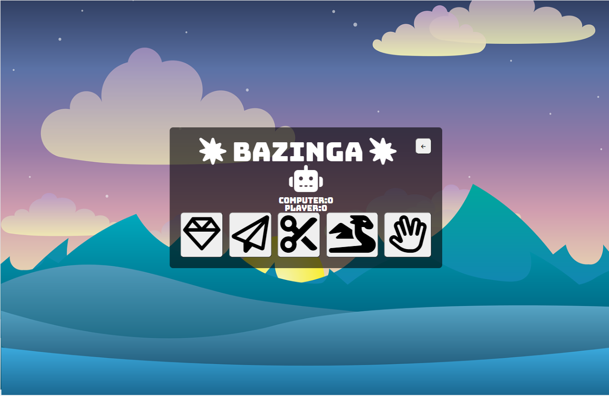

<h1 align="center">Bazinga</h1>  

## Introduction
 

Bazinga is an online game derived from your average rock paper scissors, with and influence of the Big Bang Theory, Rock Paper Scissors Lizard Spock. In which players play against the computer to win the game!

[View live project here](https://pennytrain.github.io/lizardspock/)

## User Experience

-   ### User Stories
 
-   #### First Time Visitor Goals

 1. As a first time visitor, I want the game to be clear.
 2. As a first time visitor, I want to easily navigate the game.
 3. As a first time visitor, I want the game to be aesthetically pleasing and accessible.

-   #### Returning Visitor Goals

 1. As a returning visitor, I want to enjoy the game.
 2. As a returning visitor, I want to play and show friends.
 3. As a returning visitor, I want to experiment with the different settings.

-   #### Frequent Visitor Goals

 1. As a frequent visitor, I want to have fun with the different settings.
 2. As a frequent visitor, I want the game to be smooth.
 3. As a frequent visitor, I want to enjoy playing against a computer!

-   #### Organization Goals

 1. As an organization we want to promote and make the game more popular.
 2. As an organization we want to have a base of people who play for when we realease new games.
 3. As an organization we want to be easily accessible to interested parties.

 ### Wireframe Mockups

* To do the wireframe mockups I used Balsamic.

* Windows day and night homepage

* Window day and night game page

* Window day and night settings

* Window day and night rules

* Window day and night score page

* Phone day and night homepage

* Phone day and night game page

* Phone day and night settings

* Phone day and night rules

* Phone day and night score page

### Languages Used

* [HTML](https://en.wikipedia.org/wiki/HTML)
* [CSS](https://en.wikipedia.org/wiki/CSS)
* [JavaScript](https://en.wikipedia.org/wiki/JavaScript)

### Typography

Bungee, sans-serif are being used to keep the website clear, the fonts were found using Google Fonts. 

### Color Scheme

* Day mode color scheme

* Night mode color scheme

* In these screenshots it shows that a lot of the colors do not have a good contrast, therefore I got around this using a black opaque background with white text.

## Features

* Responsive on landscape device sizes.

* There is day and night modes in the game.

* The user can toggle between 3-5 games aswell as the day/night mode in the settings.

* In the rules, I have used icons instead of words to display the meaning. 

* Along with this when a rule is hovered over it iSSncreases in size to be better displayed.

* The game box buttons light up blue when hovered over, along with text displaying above keeping score count. It also shows what exactly the player and computer picked.

* The buttons for the games are icons opposed to text. The rock is a diamond, because the best rock is a diamond!

* At the 

### Future Enhancements

* In the future I wish enable users to make an account, therefore they can keep track of how many times they have one against the computer,

* In the future, I wish to incorporate some kind of score board, where it shows how well other players are doing vs yourself.

* In the future, I wish to enable difficulty levels.

### Testing

* HTML W3 Validator

* CSS W3 Validator

 ## Deployment

The project was deployed to GitHub Pages using the following steps...

1. Log in to GitHub and locate the [GitHub Repository](https://github.com/)
2. At the top of the Repository (not top of page), locate the "Settings" Button on the menu.
    - Alternatively Click [Here](https://raw.githubusercontent.com/) for a GIF demonstrating the process starting from Step 2.
3. Scroll down the Settings page until you locate the "GitHub Pages" Section.
4. Under "Source", click the dropdown called "None" and select "Master Branch".
5. The page will automatically refresh.
6. Scroll back down through the page to locate the now published site [link](https://github.com) in the "GitHub Pages" section.

* The live link can be found here. 

### Making a Local Clone

If you would like to make a clone of this repository, you can type the following command in your terminal:

- `git clone https://pennytrain.github.io/lizardspock/`

### Forking the GitHub Repository

By forking the GitHub Repository we make a copy of the original repository on our GitHub account. Therefore we can view and/or make changes without affecting the original repository by using the following steps...

1. Log in to GitHub and find the [GitHub Repository](https://github.com/)
2. At the top of the Repository (not top of page) just above the "Settings" Button on the menu, locate the "Fork" Button.
3. You should now have a copy of the original repository in your GitHub account.

## Credits

### Content

* The text for all pages was created by myself.
* Icons used for the various links on the site were taken from [Font Awesome](https://fontawesome.com/)
* The reference material on HTML and CSS provided by [w3schools.com](https://www.w3schools.com/)

### Media

* The css reset was provided by [css reset](http://meyerweb.com/eric/tools/css/reset/)
* The Favicon, links and meta code were generated by [Realfavicongenerator.net](https://realfavicongenerator.net).
* The images used on the webisite were generated by [Pixabay](https://pixabay.com/photos/)

### Acknowledgements

* I'd like to thank the following:
- Matt Bodden, for the significant ideas for my project - your guidance truly made a difference!
- Oliver Train, for all his help regarding his patience and pointing me in the right direction.
- Dario Carrasquel, for all his help during this project as my mentor.

